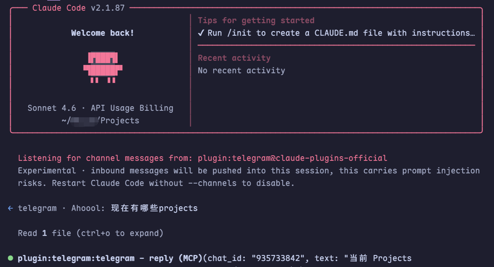

# claude-telegram-anywhere

> 解放双手👐：用 Telegram 远程指挥 Claude Code 干活



使用 Telegram 远程控制 Claude Code 的实用脚本集合，包含 Windows 和 Linux/macOS 的补丁脚本，用于修复 `--channels plugin:telegram@claude-plugins-official` 在部分环境下不可用的问题。

## Why This Repo

在某些安装方式或地区网络环境中，Claude Code 的 channels 相关决策逻辑可能导致 Telegram 插件无法正常注册。本仓库提供自动化补丁，实现：

- 渠道注册相关检查绕过（保持必要能力声明检查）
- 脚本化备份与恢复
- 跨平台（PowerShell + Bash）支持

## Repository Structure

- `apply-claude-code-channels-bypass-fix.ps1`: Windows 补丁脚本
- `apply-claude-code-channels-bypass-fix.sh`: Linux/macOS 补丁脚本
- `fix.py`: 额外兜底修复（用于补充修复特定报错）
- `README.md`: 项目说明文档

## Prerequisites

- 已安装 Claude Code
- Node.js / npm 可用（用于定位全局安装路径）
- 一个 Telegram Bot Token（通过 [@BotFather](https://t.me/BotFather) 创建）
- 建议使用 tmux/screen（服务器场景）

## Quick Start

### 1) Clone

```bash
git clone https://github.com/<your-name>/claude-telegram-anywhere.git
cd claude-telegram-anywhere
```

### 2) Apply Patch

Windows (PowerShell, 建议管理员权限):

```powershell
.\apply-claude-code-channels-bypass-fix.ps1
```

Linux/macOS:

```bash
bash apply-claude-code-channels-bypass-fix.sh
```

### 3) Start Claude with Telegram Channel

```bash
claude --channels plugin:telegram@claude-plugins-official
```

### 4) Configure Bot Token

在 Claude Code 交互命令中执行：

```text
/telegram:configure <YOUR_BOT_TOKEN>
```

### 5) Pair Your Telegram Account

1. 给你的 bot 发任意消息获取配对码
2. 在 Claude Code 执行：

```text
/telegram:access pair <PAIR_CODE>
```

3. 建议启用白名单策略：

```text
/telegram:access policy allowlist
```

## Script Options

### PowerShell (`apply-claude-code-channels-bypass-fix.ps1`)

```powershell
.\apply-claude-code-channels-bypass-fix.ps1 -Check
.\apply-claude-code-channels-bypass-fix.ps1 -Restore
.\apply-claude-code-channels-bypass-fix.ps1 -CliPath "C:\path\to\cli.js"
```

### Bash (`apply-claude-code-channels-bypass-fix.sh`)

```bash
bash apply-claude-code-channels-bypass-fix.sh --check
bash apply-claude-code-channels-bypass-fix.sh --restore
bash apply-claude-code-channels-bypass-fix.sh /path/to/cli.js
```

## Optional Extra Fix

如果你在补丁后仍遇到与 channels 列表解析相关的报错，可运行额外修复脚本：

```bash
sudo python3 fix.py
```

该脚本会直接修改 Claude Code 的 `cli.js`，请先确认你理解风险并保留备份。

## Verify It Works

1. 启动 Claude：

> 推荐安装 tmux/screen, 以便保持 Claude 后台常驻

```bash
claude --channels plugin:telegram@claude-plugins-official
```

2. 给 bot 发消息
3. 确认 Claude 终端收到事件并可回复

---

**致谢：** https://linux.do/t/topic/1787422
